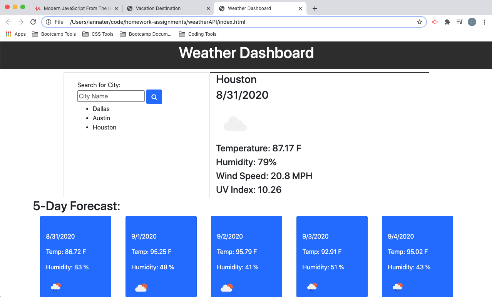

# Ian's Fully Functional Calendar
    Got a majority of the project complete and am working on wrapping up some small stuff. Honestly cant believe I got this far!

## Description 
    For this homework we built a weather dashboard that allows a user to search a city and then we return the current weather and a 5 day forecast for that city. We then store the city in local storage and recall the api if they click on it. 

## Screenshot

### Links

My repo - https://github.com/iannater/weatherAPI
My deployed page - https://iannater.github.io/weatherAPI/